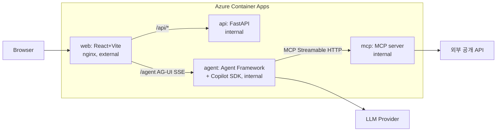

# 맞다톤 2026 — 팀 작전 브리핑

> 팀: 김현빈(Yehoshua, 팀장) + 이건주(Caleb) + 사무엘(Samuel, GitHub: `J23449595-afk`) · Copilot Max 쿠폰 적용
> 마감: **오늘 16:30 제출 마감 (넘기면 자동 탈락)** · 제출 2회 가능, **마지막 제출이 최종 점수**
> 공식: https://matdaaiga.kr/matdathon → github.com/matdaaiga-kr/matdathon-2026

---

## 1. 절대 규칙 (하나라도 어기면 탈락/최저점)

| # | 규칙 | 비고 |
|---|------|------|
| 1 | **웹 앱**으로 개발 | 필수 |
| 2 | **Microsoft Agent Framework** 사용 | 필수 |
| 3 | **GitHub Copilot SDK** 사용 | 필수 (모델 연결 담당) |
| 4 | **Azure 클라우드 배포** + 배포 URL 제출 | 필수 |
| 5 | 코딩 도구는 **GitHub Copilot 3종만** (VS Code+Copilot, Copilot CLI, Copilot App) | 타사 AI 도구 적발 시 즉시 퇴장. Copilot 안의 모델 선택은 자유. MCP 서버, az/azd CLI, Skills, Custom Agents 허용 |
| 6 | 저장소 **루트에 `PRD.md` + `TRD.md`** | 심사 에이전트의 주요 출처. README.md는 보조 |
| 7 | **로그인/인증 기능 금지** | AI 심사가 접근 못 하면 **전 항목 최저점 1점**. 공개 게스트/데모 경로만 허용 |
| 8 | **팀장 계정 저장소**로 제출 | 팀원 계정 repo 제출은 무효. 팀장이 repo 만들고 팀원에게 권한 부여 |
| 9 | **모델 호출은 팀 계정(Copilot Max 쿠폰) 기반 Copilot SDK로만** | Agent Framework의 chat client = Copilot SDK, 이 계정 인증으로 서비스 자체가 LLM 호출. 타 LLM provider API 키 사용 금지 |
| 10 | **로그인 없는 완성형 서비스로 구현** | Zapier·Notion·OpenClaw처럼 접속 즉시 전 기능 사용 가능한 SaaS급 완성도. 게스트 경로가 곧 제품 |

## 2. 심사 = AI가 100% (가중치 순 공략)

| # | 항목 | 가중치 | 공략 포인트 |
|---|------|-------:|------------|
| 1 | Copilot SDK + Agent Framework 활용 | **25%** | 두 기술 모두 앱의 **핵심 경로**에. 기능 수보다 **깊이**: 오케스트레이션, 도구 호출, 컨텍스트 처리, **스트리밍** |
| 2 | 생산성 향상 · 문제 적합성 | **18%** | 명확한 타겟 사용자 + 구체적 생산성 문제 + 입증 가능한 효과. PRD에 명시 |
| 3 | Azure 클라우드 통합 | **18%** | 의미 있는 사용 + 실제 배포. 반복 가능한 배포(aspire). **불필요한 서비스 추가는 감점**. Azure AI 사용은 가산점 아님 |
| 4 | 기능 완성도 · 기술 구현 | **16%** | E2E로 끊김 없이 동작. 에러 처리. **반응형 웹** |
| 5 | UX · 워크플로 설계 | **12%** | 직관적 UI, 로딩/지연/오류 처리, AI 동작·결과 투명하게 표시, 접근성(aria), 사용자 통제권 |
| 6 | 책임 있는 AI · 보안 | **6%** | AI 생성 결과 표시("AI가 생성함"), 위험 작업 전 확인, 시크릿 하드코딩 금지, 환각 완화 문구 |
| 7 | 혁신성 · 독창성 | **5%** | 기존 도구 단순 모방 X |

**점수 공식 요약: 1+3+4 = 59%가 "필수 기술을 깊게 쓰고 + Azure에 제대로 배포하고 + 끝까지 동작"에 달렸다. 아이디어 화려함(5%)보다 완성도.**

## 3. 제출 방법

1. 팀 등록: https://matdaaiga.kr/matdathon/issues → "팀 빌딩" 이슈, **팀장이 등록**, 포맷 정확히 준수
2. 결과 제출: 같은 이슈 탭 → "결과 제출" — **앱 제목 / 팀장 repo URL / 커밋 해시 / 배포 URL**
3. 리더보드: https://matdaaiga.kr/matdathon/leaderboard (실시간)
4. 전략: **1차 제출은 일찍(≈14:30~15:00)** 점수 확인 → 개선 → **2차(최종)는 16:10까지**. 2차 점수가 낮아도 2차가 최종이므로, 2차 제출 전 핵심 플로우 리그레션 확인 필수

## 4. 참조 아키텍처 (강사 예제: github.com/devkimchi/battle-school-lunch)



- **3 레이어**: AI/LLM → Agent Framework · Tools → MCP · Infra → Aspire
- Aspire AppHost는 **TypeScript(`apphost.mts`)로 작성 가능** (.NET 코드 불필요, aspire CLI만 필요)
- 배포: `az login` → `aspire deploy` 한 방. Dockerfile/Compose 불필요. Azure Container Apps + scale-to-zero. 삭제는 `aspire destroy`
- 멀티에이전트 패턴: 전문 에이전트 N개 **Concurrent 실행** → **Judge가 fan-in 종합** (강의 데모와 동일 패턴, 심사항목 1번 직격)
- 프론트는 에이전트 응답을 **SSE 스트리밍**으로 받아 진행 단계(phase) 표시 → 심사 1번(스트리밍) + 5번(투명성) 동시 공략

## 5. 개발 워크플로 (강사 권장 + 우리 실행안)

**문서 먼저 (30분 내), 코드는 그다음:**

> **원샷 개발 전략 (현빈 확정)**: IDEATION→PRD→TRD를 완전하게 만든 뒤, md만으로 전체 구현을 1회에 끝낸다. 문서 = 코드 스펙 (데이터 스키마·화면·UI 카피·에러 상태·샘플 데이터까지 명시). 각 단계마다 현빈 질의응답 + 타 모델 교차검증 필수.

| 순서 | 문서 | 내용 | 검증 |
|-----|------|------|------|
| 1 | `AGENTS.md` | 코딩 에이전트 동작 범위·규칙 | 필요할 때 계속 수정 |
| 2 | `IDEATION.md` | 아이디어 (후보 → 확정) | **다양한 모델로 교차 검증** |
| 3 | `PRD.md` | 요구사항·기능·인수조건 (PM/PO 관점) | **다른 모델로 검증** |
| 4 | `TRD.md` | 스택·아키텍처·API·데이터 모델 | 이해될 때까지 + 다른 모델로 검증 |

**바이브 코딩 꿀팁 4 (강사):**
1. 계획(PRD/TRD) 기준으로 **개발↔테스트 반복** — 코파일럿이 헤매지 않게
2. **작업 주제가 바뀌면 새 세션** — 컨텍스트 오염 방지
3. 배포 후 **Playwright로 실사용 테스트** 시키기 ("배포된 URL에 접속해서 사람처럼 테스트해줘")
4. **핵심 기능이 되는 순간 즉시 1차 배포 + 접속 URL 확인** — 배포를 마지막으로 미루지 말 것
+ AI는 과복잡화 경향 → 1차 결과물 나오면 "코드 간결하게 정리해줘" 요청

## 6. 역할 분담 (3인)

| 담당 | 김현빈 (팀장) | 이건주 | 사무엘 |
|------|--------------|--------|--------|
| 문서 | PRD.md, 제출 이슈 | TRD.md 검증 | PRD/UX 카피 검토 |
| 개발 | 인프라(Aspire AppHost, Azure 배포), repo 세팅 | 앱 코어(agent instructions, MCP 도구, web UI) | web UI 폴리시(반응형·접근성·AI 라벨) |
| 검증 | 배포 URL 스모크 테스트, 리더보드 | Playwright E2E | 배포 URL 실사용 테스트(모바일 포함) |

> 팀 등록·결과 제출·repo 생성은 전부 **팀장 계정** 기준.

## 7. 타임라인 (지금 ~ 16:30)

| 시각 | 할 일 |
|------|------|
| ~12:00 | 환경 최종 점검(아래 8), 팀장 repo 생성+권한 부여, 팀 빌딩 이슈 등록, 아이디어 확정(IDEATION.md) |
| 12:00–12:30 | PRD.md / TRD.md 작성 → 다른 모델로 교차 검증 → repo 루트에 커밋 |
| 12:30–14:30 | MVP 코어: mcp → agent(Agent Framework+Copilot SDK) → web 순. 로컬 `aspire run`으로 상시 확인 |
| 14:30–15:00 | **1차 배포**(`aspire deploy`) → 배포 URL 열어 핵심 플로우 확인 → **1차 제출** → 점수 확인 |
| 15:00–16:00 | 점수 피드백 기반 개선: UX 폴리시(로딩/에러/AI 표시), 반응형, PRD/TRD 보강 |
| 16:00–16:10 | 최종 배포 + 배포 URL 리그레션(Playwright) → **2차(최종) 제출** |
| 16:10–16:30 | 버퍼. 제출 포맷 재확인 |

## 8. 환경 체크리스트 (김현빈 맥 기준 — 2026-08-22 11:40 확인)

- [x] `az` CLI — 설치됨, **로그인됨** (협성고 김현빈 / innodgvibeventure 테넌트 구독)
- [x] `azd`, `dotnet`, `node`, `npm`, `gh`, `copilot`(CLI), `python3`, `git` — 설치됨
- [ ] **`aspire` CLI — 미설치. 아래 명령으로 설치 필요**
- [ ] GitHub Copilot 쿠폰 확인: github.com/settings/copilot → Billing & Licenses → Payment information에 **Max 적용** 표시 확인 (Pro/Pro+/학생팩 계정이면 새 계정 필요)
- [ ] 이건주 노트북도 동일 체크

**aspire CLI 설치 — 터미널(셸) 명령, 한 줄씩 붙여넣기:**

```bash
brew install aspire
```

실행 후 정상 화면: `aspire`가 설치되고, 이어서 `aspire --version` 입력 시 버전 번호(예: `13.x.x`)가 출력되면 정상. `command not found`가 나오면 터미널을 새로 열고 다시 확인.

대안(brew 실패 시):

```bash
curl -sSL https://aspire.dev/install.sh | bash
```

## 9. 링크 모음

- 공식 README: https://github.com/matdaaiga-kr/matdathon-2026
- 심사 기준(가중치): https://matdaaiga.kr/matdathon/judgement-criteria
- 규칙: https://matdaaiga.kr/matdathon/policy-rules
- 팀 등록/제출 이슈: https://matdaaiga.kr/matdathon/issues
- 리더보드: https://matdaaiga.kr/matdathon/leaderboard
- 강사 예제(구조 그대로 벤치마킹): https://github.com/devkimchi/battle-school-lunch
- Awesome Copilot(커스텀 인스트럭션 모음): https://bit.ly/awesome-cop
- Azure Skills 설치·구성: https://bit.ly/azskills
- Copilot SDK: https://github.com/github/copilot-sdk · Agent Framework: https://github.com/microsoft/agent-framework
