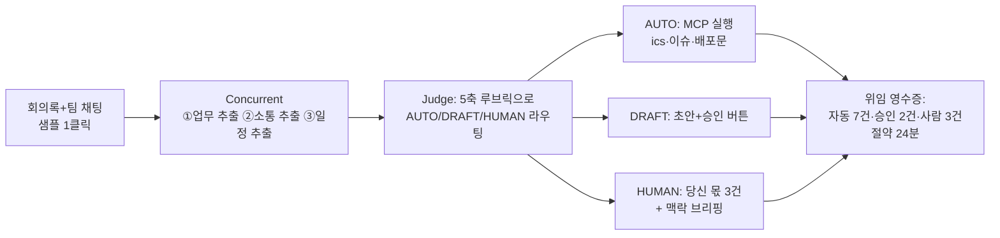

# talk.md — 아이디어 구상 로그

> 목적: 현빈이 말로 구상한 것을 시간순으로 기록해 전체 사고 과정을 보존. 이건주도 Copilot에서 이 파일을 컨텍스트로 사용.
> 규칙: 새 구상이 나올 때마다 아래에 append. 기존 항목 수정 금지(과정 보존).

---

## [08-22 12:21] 방향 제시 — 2트랙 개인 중심 AI (현빈)

- 미팅부터 개발, 팀원 간 소통까지 **전체를 관리해주는 AI 에이전트**가 중심.
- Meditor(meditor.cc)는 회의 중재 서비스. 우리는 그보다 **팀원 개인에 집중**.
- 2트랙: ① 개인이 직접 관여해야 하는 업무/소통 ② agentic하게 자동화할 수 있는 것 — 이걸 AI가 파악해서 자동화.
- 구체적 구분 방법, 자동화 방법, MCP 활용은 미정 (비개발자라 구상 필요).

## [08-22 12:21] 정리 — Offload(가칭) 컨셉 (Copilot)

**한 줄**: 회의록·채팅·업무 로그를 넣으면, 에이전트 팀이 모든 항목을 "당신만 할 수 있는 일"과 "AI가 이미 처리한 일" 두 트랙으로 갈라서 — AI 몫은 실행까지 끝내고, 사람 몫은 바로 착수 가능한 브리핑으로 준다.

**Meditor와의 관계**: Meditor는 *회의 중* + *팀 단위* 중재. 이건 *회의 사이* + *개인 단위* 위임 판단. 안 겹치고 이어짐.

### 핵심 = 분류 엔진 (혁신 포인트)

3단계 라우팅 — 완전 이분법이 아니라 중간 지대(승인)가 실제로 제일 큼:

| 트랙 | 의미 | 예시 |
|---|---|---|
| **AUTO** | AI가 실행까지 완료, 영수증만 남김 | 회의록 배포, 일정 .ics 생성, 액션아이템→이슈 등록, 리마인드 |
| **DRAFT** | AI가 초안 완성, 사람은 원클릭 승인/수정 | 클라이언트 답장, 공지문, 리뷰 요청 배정 |
| **HUMAN** | 사람만 가능. AI는 맥락 브리핑만 준비 | 의사결정, 갈등/피드백 대화, 협상, 채용 |

**분류 루브릭 (Judge 에이전트가 항목마다 5축 채점, 근거 표시):**

1. 판단 기준이 명문화 가능한가 (규칙화 가능 → AUTO 쪽)
2. 되돌리기 쉬운가 (되돌림 가능 → AUTO 쪽)
3. 감정·관계가 걸리는가 (걸리면 → HUMAN 쪽)
4. 권한·책임이 본인 고유인가 (고유 → HUMAN 쪽)
5. 실패 비용 (크면 한 단계 위로 격상)

→ "왜 이건 네 몫인지"를 근거와 함께 보여줌. Meditor 철학(근거+출처)과 일치.

### MCP 활용

MCP = AI가 외부 도구를 실제로 조작하게 해주는 표준 소켓. 에이전트가 **판단**, MCP 도구가 **실행**.

- `calc_dates` 마감 검증 · `make_ics` 캘린더 파일 · `create_issue` 액션아이템→이슈 포맷 · `draft_message` 공지/답장 초안
- 해커톤에선 실제 Slack/GitHub 연동 대신 **다운로드 가능한 산출물**(ics, 이슈 md, 메일 초안)로 대체 — 외부 키 0개, 장애 리스크 0

### 파이프라인 (AfterMeet 골격 재사용)

### 심사 기준 대비 — AfterMeet 대비 개선점

- **책임 AI 6%**: 자동/승인/사람 구분 자체가 human-in-the-loop 설계 = 교과서적 만점 답안
- **혁신성 5%**: "요약기"가 아니라 **위임 판단 엔진** — 명확한 트위스트
- **UX 12%**: 승인 버튼 = 사용자 통제권 증거
- SDK 깊이·Azure·완성도는 동일 (골격 재사용, 추가 개발은 Judge 라우팅 프롬프트 + 결과 3분할 UI 정도)

## [08-22 12:28] 구체화 — 미팅 자체를 트리아지 (현빈)

구체적인 예시:

- 미팅에서 **기존 기술/제품/프로젝트 진행상황** 같은 내용을 다뤄야 하면 → 미팅 없이 AI가 히스토리나 워크스페이스를 보고 찾아주거나, 상대방한테 바로 전달.
- **기술 개발 등 자동화 가능한 업무 측면의 미팅** → 팀원(직원) 간 **에이전트끼리 회의**하게 함.
- 사람에게는 **진짜 필요한 미팅**(팀 비전, 성장 등)과 **생산성 있는 일**(운동, 커피챗, 팀 빌딩 활동 등)에 대한 관리를 해줌.

→ 이것이 2트랙의 실체.

## [08-22 12:28] 정리 — 미팅 트리아지 3단계 (Copilot)

위 예시를 분류 엔진에 통합하면, **업무 항목뿐 아니라 "미팅 자체"가 트리아지 대상**이 된다:

| 단계 | 미팅 유형 | 처리 |
|---|---|---|
| **① 미팅 소멸** | 정보 공유형 (진행상황, 기존 기술/제품 히스토리) | 미팅을 열 필요 없음. 에이전트가 워크스페이스·히스토리에서 찾아 답을 만들어 상대에게 바로 전달 |
| **② 에이전트 대리 회의** | 조율형 (기술 스펙 조율, 일정 조정, 작업 분배 등 기준이 명확한 것) | 각 팀원의 에이전트끼리 회의(agent-to-agent) 후 합의안 + 근거를 양쪽 사람에게 보고. 사람은 승인만 |
| **③ 사람 회의** | 비전·성장·창의·관계형 | 사람이 직접. 에이전트는 브리핑 준비 + 이 시간을 지키기 위해 ①②를 대신 수행 |

**핵심 리프레이밍**: 이 제품의 목적은 "회의를 잘 정리해주는 것"이 아니라 **"사람의 캘린더에서 기계가 할 수 있는 미팅을 지우고, 그 자리를 사람만 할 수 있는 것(비전 논의, 운동, 커피챗, 팀 빌딩)으로 채우는 것"**. 즉 산출물은 할일 목록이 아니라 **되찾은 시간**.

- 지표: "이번 주 미팅 6개 중 2개 소멸, 2개 에이전트 대리, 2개만 사람 참석 → 3시간 회수"
- 회수된 시간의 사용처까지 제안(운동, 커피챗, 팀 빌딩)하는 것이 개인 집중 차별점.
- 데모 적용: 입력(팀 채팅 + 미팅 요청 목록) → 미팅별 ①②③ 판정 + 근거 → ②는 에이전트 간 회의 로그를 스트리밍으로 보여주기(심사 1번 스트리밍 + 5번 투명성 직격) → 하단에 "되찾은 시간 영수증".

## [08-22 12:32] 통합 정리 — 전체 컨셉 확정본 (Copilot)

### 컨셉

**Offload(가칭) — 팀의 미팅과 업무를 "사람 몫 / AI 몫"으로 갈라주는 개인 중심 AI 비서**

**한 줄**: 팀의 미팅·업무·소통을 전부 트리아지해서 — AI 몫은 에이전트가 직접 처리하거나 팀원 에이전트끼리 회의해서 끝내고, 사람에게는 진짜 필요한 미팅(비전·성장)과 생산적인 시간(운동·커피챗·팀 빌딩)만 남겨준다. 산출물은 할일 목록이 아니라 **되찾은 시간**.

### 핵심 3요소

**1) 위임 판단 엔진** — 모든 항목을 5축 루브릭(명문화 가능성 / 되돌림 가능성 / 감정·관계 / 권한 고유성 / 실패 비용)으로 채점해 3트랙 라우팅. 근거를 항상 표시.

| 트랙 | 처리 |
|---|---|
| AUTO | AI가 실행까지 완료, 영수증만 남김 |
| DRAFT | AI가 초안, 사람은 원클릭 승인/수정 |
| HUMAN | 사람 몫. AI는 맥락 브리핑만 준비 |

**2) 미팅 트리아지** — 업무 항목만이 아니라 미팅 자체가 트리아지 대상.

| 단계 | 대상 | 처리 |
|---|---|---|
| ① 미팅 소멸 | 정보 공유형 (진행상황, 히스토리) | 에이전트가 워크스페이스에서 찾아 상대에게 바로 전달 |
| ② 에이전트 대리 회의 | 조율형 (스펙·일정·분배) | 팀원 에이전트끼리 회의 → 합의안+근거 보고, 사람은 승인만 |
| ③ 사람 회의 | 비전·성장·창의·관계형 | 사람이 직접, AI는 브리핑 준비 |

**3) 되찾은 시간 관리** — "미팅 6개 중 2개 소멸·2개 대리·2개만 참석 → 3시간 회수" 영수증 + 회수 시간의 사용처(운동, 커피챗, 팀 빌딩) 제안·관리.

### 포지셔닝

- Meditor: 회의 *중* + *팀* 단위 중재 ↔ Offload: 회의 *사이* + *개인* 단위 위임. 겹치지 않고 이어짐.
- 기존 노트테이커/요약기와의 차이: 회의를 잘 기록하는 게 아니라 **회의를 캘린더에서 지우는 것**.

### 실행 구조 (해커톤 제약 반영)

- 에이전트가 **판단**(Concurrent 전문가 + Judge 라우팅), MCP 도구가 **실행**(`calc_dates`, `make_ics`, `create_issue`, `draft_message`).
- 외부 연동 대신 다운로드 가능한 산출물(ics·이슈 md·메시지 초안) — 외부 키 0개.
- 데모 60초: 샘플 1클릭 → 미팅·업무 트리아지 판정 스트리밍 → ② 에이전트 간 회의 로그 관람 → 3트랙 결과 + 되찾은 시간 영수증.

### 심사 매핑

SDK 깊이(멀티에이전트+MCP+스트리밍) / 생산성(시간 회수 정량화) / 책임 AI(3트랙 = human-in-the-loop 설계) / 혁신성(요약기가 아닌 위임 판단 엔진) 전 항목 커버. AfterMeet 골격 재사용으로 구현 리스크 최소.
