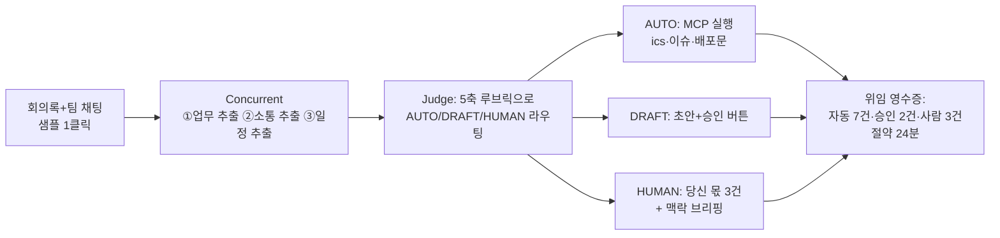

# talk.md — 아이디어 구상 로그

> 목적: 현빈이 말로 구상한 것을 시간순으로 기록해 전체 사고 과정을 보존. 이건주도 Copilot에서 이 파일을 컨텍스트로 사용.
> 규칙: 새 구상이 나올 때마다 아래에 append. 기존 항목 수정 금지(과정 보존).

---

## [08-22 12:21] 방향 제시 — 2트랙 개인 중심 AI (현빈)

- 미팅부터 개발, 팀원 간 소통까지 **전체를 관리해주는 AI 에이전트**가 중심.
- Meditor(meditor.cc)는 회의 중재 서비스. 우리는 그보다 **팀원 개인에 집중**.
- 2트랙: ① 개인이 직접 관여해야 하는 업무/소통 ② agentic하게 자동화할 수 있는 것 — 이걸 AI가 파악해서 자동화.
- 구체적 구분 방법, 자동화 방법, MCP 활용은 미정 (비개발자라 구상 필요).

## [08-22 12:21] 정리 — Offload(가칭) 컨셉 (Copilot)

**한 줄**: 회의록·채팅·업무 로그를 넣으면, 에이전트 팀이 모든 항목을 "당신만 할 수 있는 일"과 "AI가 이미 처리한 일" 두 트랙으로 갈라서 — AI 몫은 실행까지 끝내고, 사람 몫은 바로 착수 가능한 브리핑으로 준다.

**Meditor와의 관계**: Meditor는 *회의 중* + *팀 단위* 중재. 이건 *회의 사이* + *개인 단위* 위임 판단. 안 겹치고 이어짐.

### 핵심 = 분류 엔진 (혁신 포인트)

3단계 라우팅 — 완전 이분법이 아니라 중간 지대(승인)가 실제로 제일 큼:

| 트랙 | 의미 | 예시 |
|---|---|---|
| **AUTO** | AI가 실행까지 완료, 영수증만 남김 | 회의록 배포, 일정 .ics 생성, 액션아이템→이슈 등록, 리마인드 |
| **DRAFT** | AI가 초안 완성, 사람은 원클릭 승인/수정 | 클라이언트 답장, 공지문, 리뷰 요청 배정 |
| **HUMAN** | 사람만 가능. AI는 맥락 브리핑만 준비 | 의사결정, 갈등/피드백 대화, 협상, 채용 |

**분류 루브릭 (Judge 에이전트가 항목마다 5축 채점, 근거 표시):**

1. 판단 기준이 명문화 가능한가 (규칙화 가능 → AUTO 쪽)
2. 되돌리기 쉬운가 (되돌림 가능 → AUTO 쪽)
3. 감정·관계가 걸리는가 (걸리면 → HUMAN 쪽)
4. 권한·책임이 본인 고유인가 (고유 → HUMAN 쪽)
5. 실패 비용 (크면 한 단계 위로 격상)

→ "왜 이건 네 몫인지"를 근거와 함께 보여줌. Meditor 철학(근거+출처)과 일치.

### MCP 활용

MCP = AI가 외부 도구를 실제로 조작하게 해주는 표준 소켓. 에이전트가 **판단**, MCP 도구가 **실행**.

- `calc_dates` 마감 검증 · `make_ics` 캘린더 파일 · `create_issue` 액션아이템→이슈 포맷 · `draft_message` 공지/답장 초안
- 해커톤에선 실제 Slack/GitHub 연동 대신 **다운로드 가능한 산출물**(ics, 이슈 md, 메일 초안)로 대체 — 외부 키 0개, 장애 리스크 0

### 파이프라인 (AfterMeet 골격 재사용)

### 심사 기준 대비 — AfterMeet 대비 개선점

- **책임 AI 6%**: 자동/승인/사람 구분 자체가 human-in-the-loop 설계 = 교과서적 만점 답안
- **혁신성 5%**: "요약기"가 아니라 **위임 판단 엔진** — 명확한 트위스트
- **UX 12%**: 승인 버튼 = 사용자 통제권 증거
- SDK 깊이·Azure·완성도는 동일 (골격 재사용, 추가 개발은 Judge 라우팅 프롬프트 + 결과 3분할 UI 정도)

## [08-22 12:28] 구체화 — 미팅 자체를 트리아지 (현빈)

구체적인 예시:

- 미팅에서 **기존 기술/제품/프로젝트 진행상황** 같은 내용을 다뤄야 하면 → 미팅 없이 AI가 히스토리나 워크스페이스를 보고 찾아주거나, 상대방한테 바로 전달.
- **기술 개발 등 자동화 가능한 업무 측면의 미팅** → 팀원(직원) 간 **에이전트끼리 회의**하게 함.
- 사람에게는 **진짜 필요한 미팅**(팀 비전, 성장 등)과 **생산성 있는 일**(운동, 커피챗, 팀 빌딩 활동 등)에 대한 관리를 해줌.

→ 이것이 2트랙의 실체.

## [08-22 12:28] 정리 — 미팅 트리아지 3단계 (Copilot)

위 예시를 분류 엔진에 통합하면, **업무 항목뿐 아니라 "미팅 자체"가 트리아지 대상**이 된다:

| 단계 | 미팅 유형 | 처리 |
|---|---|---|
| **① 미팅 소멸** | 정보 공유형 (진행상황, 기존 기술/제품 히스토리) | 미팅을 열 필요 없음. 에이전트가 워크스페이스·히스토리에서 찾아 답을 만들어 상대에게 바로 전달 |
| **② 에이전트 대리 회의** | 조율형 (기술 스펙 조율, 일정 조정, 작업 분배 등 기준이 명확한 것) | 각 팀원의 에이전트끼리 회의(agent-to-agent) 후 합의안 + 근거를 양쪽 사람에게 보고. 사람은 승인만 |
| **③ 사람 회의** | 비전·성장·창의·관계형 | 사람이 직접. 에이전트는 브리핑 준비 + 이 시간을 지키기 위해 ①②를 대신 수행 |

**핵심 리프레이밍**: 이 제품의 목적은 "회의를 잘 정리해주는 것"이 아니라 **"사람의 캘린더에서 기계가 할 수 있는 미팅을 지우고, 그 자리를 사람만 할 수 있는 것(비전 논의, 운동, 커피챗, 팀 빌딩)으로 채우는 것"**. 즉 산출물은 할일 목록이 아니라 **되찾은 시간**.

- 지표: "이번 주 미팅 6개 중 2개 소멸, 2개 에이전트 대리, 2개만 사람 참석 → 3시간 회수"
- 회수된 시간의 사용처까지 제안(운동, 커피챗, 팀 빌딩)하는 것이 개인 집중 차별점.
- 데모 적용: 입력(팀 채팅 + 미팅 요청 목록) → 미팅별 ①②③ 판정 + 근거 → ②는 에이전트 간 회의 로그를 스트리밍으로 보여주기(심사 1번 스트리밍 + 5번 투명성 직격) → 하단에 "되찾은 시간 영수증".

## [08-22 12:32] 통합 정리 — 전체 컨셉 확정본 (Copilot)

### 컨셉

**Offload(가칭) — 팀의 미팅과 업무를 "사람 몫 / AI 몫"으로 갈라주는 개인 중심 AI 비서**

**한 줄**: 팀의 미팅·업무·소통을 전부 트리아지해서 — AI 몫은 에이전트가 직접 처리하거나 팀원 에이전트끼리 회의해서 끝내고, 사람에게는 진짜 필요한 미팅(비전·성장)과 생산적인 시간(운동·커피챗·팀 빌딩)만 남겨준다. 산출물은 할일 목록이 아니라 **되찾은 시간**.

### 핵심 3요소

**1) 위임 판단 엔진** — 모든 항목을 5축 루브릭(명문화 가능성 / 되돌림 가능성 / 감정·관계 / 권한 고유성 / 실패 비용)으로 채점해 3트랙 라우팅. 근거를 항상 표시.

| 트랙 | 처리 |
|---|---|
| AUTO | AI가 실행까지 완료, 영수증만 남김 |
| DRAFT | AI가 초안, 사람은 원클릭 승인/수정 |
| HUMAN | 사람 몫. AI는 맥락 브리핑만 준비 |

**2) 미팅 트리아지** — 업무 항목만이 아니라 미팅 자체가 트리아지 대상.

| 단계 | 대상 | 처리 |
|---|---|---|
| ① 미팅 소멸 | 정보 공유형 (진행상황, 히스토리) | 에이전트가 워크스페이스에서 찾아 상대에게 바로 전달 |
| ② 에이전트 대리 회의 | 조율형 (스펙·일정·분배) | 팀원 에이전트끼리 회의 → 합의안+근거 보고, 사람은 승인만 |
| ③ 사람 회의 | 비전·성장·창의·관계형 | 사람이 직접, AI는 브리핑 준비 |

**3) 되찾은 시간 관리** — "미팅 6개 중 2개 소멸·2개 대리·2개만 참석 → 3시간 회수" 영수증 + 회수 시간의 사용처(운동, 커피챗, 팀 빌딩) 제안·관리.

### 포지셔닝

- Meditor: 회의 *중* + *팀* 단위 중재 ↔ Offload: 회의 *사이* + *개인* 단위 위임. 겹치지 않고 이어짐.
- 기존 노트테이커/요약기와의 차이: 회의를 잘 기록하는 게 아니라 **회의를 캘린더에서 지우는 것**.

### 실행 구조 (해커톤 제약 반영)

- 에이전트가 **판단**(Concurrent 전문가 + Judge 라우팅), MCP 도구가 **실행**(`calc_dates`, `make_ics`, `create_issue`, `draft_message`).
- 외부 연동 대신 다운로드 가능한 산출물(ics·이슈 md·메시지 초안) — 외부 키 0개.
- 데모 60초: 샘플 1클릭 → 미팅·업무 트리아지 판정 스트리밍 → ② 에이전트 간 회의 로그 관람 → 3트랙 결과 + 되찾은 시간 영수증.

### 심사 매핑

SDK 깊이(멀티에이전트+MCP+스트리밍) / 생산성(시간 회수 정량화) / 책임 AI(3트랙 = human-in-the-loop 설계) / 혁신성(요약기가 아닌 위임 판단 엔진) 전 항목 커버. AfterMeet 골격 재사용으로 구현 리스크 최소.

## [08-22 12:37] 철학 제시 — 팀의 존재 방식과 최종 목표 (현빈)

- **아바타 회의**: 나의 아바타가 대신 회의에 참여하고 의사결정하고, 나의 창의성을 미팅 맥락에 따라 막힘없이 풀어헤치는 회의. 미팅 장소를 어디든 선택하고, 그 장소 자체의 밀도와 집중도가 높게 만들기 — **미팅 공간 설계**.
- **하루의 설계**: 몰입에 젖는 미친 2~3시간. 서로 사랑을 전하며 팀의 의미를 재정의하는 30분. 버릴 것 = 가장 중요한 20%의 과제를, 80%의 잡다한 일을 변명 삼아 직면하길 피하는 것.
- **24/7 미팅 보드**: 팀원들의 생각이 지속적으로 공유되고 역사가 쌓이는 미팅. 팀원끼리 각자가 생각하는 제품을 향한 철학적 정의와 감도, 사업의 원형을 구성.
- **교제·나눔·공동체** (행 2:42, 빌 1:5): 단순 협력이 아니라 삶을 나누는 사귐. 삶을 나눈다는 것은 나 자신을 나누는 것, 영적 동역자가 되는 것. 사고의 방법은 다르나 믿음이 한 방향을 향하고, 사랑과 영적 성장을 위한 나눔을 기뻐하는 것. 그 사랑의 밀도만 보고서 국가급 사람이 합류하는 팀.
- **업무 = 컴포넌트**: 업무 자체를 하나의 컴포넌트로, 팀원 각각의 업무 agent가 서로와 미팅한다.
- **최종 목표**: 이 철학을 반영해 **차세대 Cursor, OpenClaw**가 되는 것.

## [08-22 12:37] 정리 — 비전 아키텍처 3층 (Copilot)

철학을 제품 구조로 번역하면 3층이 된다. 아래로 갈수록 원료, 위로 갈수록 목적.

| 층 | 이름 | 내용 |
|---|---|---|
| **3층 (목적)** | 사람의 시간 설계 | 몰입 2~3h 블록 + 사랑·의미의 30분 + 진짜 필요한 미팅만. 미팅 공간 설계(장소·밀도·집중도)까지 포함. 80% 잡일을 위임하는 이유는 효율이 아니라 **20% 핵심 직면 회피를 없애기 위함** |
| **2층 (엔진)** | 아바타 & 업무 에이전트 | 업무 = 컴포넌트. 각자의 업무 agent가 서로 미팅하고, 아바타는 나의 철학·감도·판단 기준을 학습해 **대리 의사결정 + 맥락에 맞춘 창의성 발현**. 기존 "에이전트 대리 회의(②)"의 완성형 |
| **1층 (원료)** | 24/7 미팅 보드 | 생각·철학적 정의·감도·사업의 원형이 비동기로 쌓이는 역사. **이 기록이 곧 아바타의 인격과 판단 모델의 학습 데이터** — 보드에 쌓일수록 아바타가 나다워짐 |

**연결 고리 (제품의 자기강화 루프)**: 보드에 생각을 쌓을수록(1층) → 아바타가 더 정확히 나를 대리하고(2층) → 사람의 시간이 더 많이 회수되어(3층) → 그 시간에 몰입·나눔·철학을 하고 그것이 다시 보드에 쌓인다(1층).

**공동체 철학의 제품적 의미**: 이 도구의 성공 지표는 처리량이 아니라 **사귐의 밀도**. "사랑의 밀도만 보고 국가급 사람이 합류하는 팀"이 되려면, 도구가 잡무를 흡수하고 사람에게는 삶을 나누는 시간만 남아야 한다. → 지표 후보: 몰입 블록 보호율, 사람-미팅의 질(비전/성장 비중), 보드에 쌓인 철학의 역사량.

**포지셔닝 재정의**: Cursor = 코드 에디터에 에이전트를 심은 것. 우리 = **팀의 운영 전체에 에이전트를 심은 것 — "팀 OS"**. 코드가 아니라 시간·미팅·사귐이 다루는 대상.

**해커톤 슬라이스 (오늘 16:30)**: 위 비전 전체가 아니라 **2층의 한 조각** — 미팅 트리아지 + 에이전트 대리 회의 + 되찾은 시간 영수증 — 만 데모. 1층(보드)·3층(시간 설계)은 PRD의 로드맵 섹션에 비전으로 기술 (심사 AI가 읽고 혁신성 근거로 삼게).

## [08-22 12:48] 피벗 — 아바타 = 사내 페르소나 (현빈)

- 회사에서의 나는 페르소나가 다르고 사내 이름(영어이름 등)도 있다 → **그 사내 페르소나 아바타를 중심으로 에이전트 개념을 구체화**하자.
- 진행 방식 확정: 이걸 바탕으로 IDEATION.md부터 다시 만들고, 나(현빈)에게 질문하면서 구체화해간다.
- AGENTS.md는 계속 수정. **IDEATION → PRD → TRD 순서**로 작성하되, 각 단계마다 ① 현빈에게 질문 ② 여러 모델 교차검증을 반드시 거친다.
- 이전 세션에서 정리한 평가기준·필수요소(HACKATHON.md)를 전 과정에서 유지.

## [08-22 12:48] 정리 — 아바타 컨셉의 제품화 (Copilot)

- **아바타의 그릇 = 사내 페르소나 카드**: 영어이름·역할·판단 기준·우선순위·양보 가능선·레드라인·감도. 이 카드가 그대로 에이전트 instructions로 동적 주입된다 — "인격의 프롬프트화". 1층(24/7 보드)이 쌓이기 전의 MVP 버전 인격 원료.
- **사내 영어이름 문화의 힘**: 사람들은 이미 "회사에서의 나 = 별도 인격"을 승인한 상태. 아바타에게 위임하는 것이 '나를 복제'가 아니라 '이미 존재하는 업무 인격에게 몸을 줌'이 되어 심리적 저항이 낮다 — 제품 스토리 포인트.
- IDEATION.md v2로 재작성: AfterMeet 골격(Concurrent+Judge+MCP+SSE) 재사용, 프레이밍을 "아바타 회의"로 전환. 상세는 IDEATION.md 참조.

## [08-22 12:52] 제약 추가 — Copilot Max 계정 기반 호출 + 원샷 개발 (현빈)

- **Microsoft Agent Framework의 모델 호출은 이 계정(Copilot Max 쿠폰 적용)의 Copilot SDK를 통해야 한다. 서비스 자체가.** → HACKATHON.md에 규칙으로 명문화.
- **md들로 전체 원샷 개발**해서 1등(100점)을 끝낸다 → 문서가 곧 코드 스펙이 되도록 완전하게 작성.
- 구현 수준: **로그인이 없는 Zapier·Notion·OpenClaw 같은 서비스**처럼 — 접속 즉시 쓰는 완성형 SaaS급.

## [08-22 12:52] 정리 (Copilot)

- HACKATHON.md 절대규칙에 9(Copilot Max 계정 인증 = 유일한 모델 연결, 타 LLM 키 금지)·10(무로그인 즉시 사용 SaaS 완성도) 추가. 원샷 개발 전략도 워크플로에 명시.
- AGENTS.md에 동일 제약 반영 (코딩 에이전트가 원샷 구현 시 준수).
- 따라서 PRD/TRD는 스키마·화면·UI 카피·에러 상태·샘플 데이터까지 박제해서 "문서만 읽고 전체 구현 가능" 수준으로 작성한다.

## [08-22 12:57] 결정 — 이름·시나리오·P0 범위 (현빈)

- 앱 이름: **Standin(스탠드인)**
- 샘플 안건: **기능 우선순위 조율** (다음 스프린트 순서)
- 페르소나 카드 **편집 = P0** — 프리셋 1클릭 + 직접 편집 모두. 무로그인 즉시 사용 서비스 감성 우선.

## [08-22 13:05] 교차검증 결과 + v2-lite 확정 (GPT-5.6 → 현빈 승인)

GPT-5.6 검증 요지: v2 원안("회의 대체")은 방어 불가 — 아바타가 실제 협상을 안 하므로 단일 LLM 역할극으로 보일 위험. 기대점수 ~55점. 개선안:

1. 프레이밍: 회의 대체 → **프리플라이트(사전조율)**. 후보안 2~3개 + 타입화된 제약 입력, 아바타별 ACCEPT/REJECT, **전원 통과안만 RESOLVED** (판정은 LLM 아닌 결정적 코드), 충돌만 사람 회의로.
2. Facilitator는 타협안 발명 금지 — 근거 인용·브리핑만.
3. 시간 영수증 정직화: 잠재 절감 추정치 라벨, 실행시간은 실측.
4. 레드라인은 `field/operator/value` 타입화 규칙만 결정적 검사.
5. P0 컷 박제 + 산출물은 v1 실행패키지(결정 md·.ics) 재사용. 1순위 리스크 = Azure에서 Copilot Max 비대화형 인증 (TRD에서 최우선 검증).

→ **현빈 결정: v2-lite 채택.** IDEATION.md 확정본으로 재작성 완료. 아바타·철학·Standin 이름 유지.
